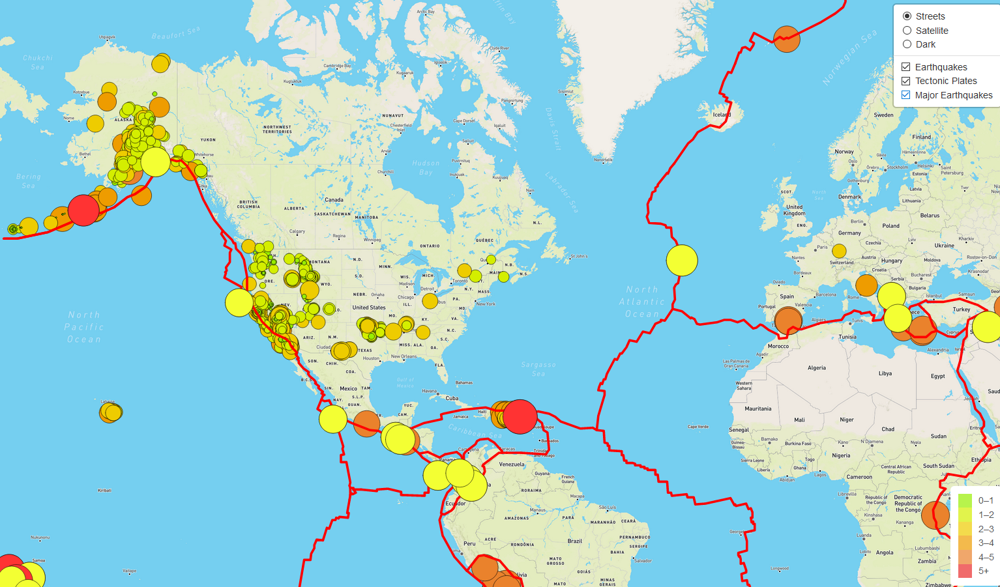

# Mapping_Earthquakes
Mapping Earthquake data using Leaflet.JS, D3.JS and Mapbox API

## Purpose
The purpose of this project is to visually show the differences between the magnitudes of earthquakes all over the world for the last seven days. This is showed as an overlay with techtonic plates and also major earthquakes (magnitude>4) highlighted as well.

## Approach

The approach used is using JavaScript and the D3.js library to retrieve the coordinates and magnitudes of the earthquakes from the GeoJSON data. The Leaflet library is used to plot the data on a Mapbox map through an API request and created interactivly for the earthquake data.

## Result

</img>
